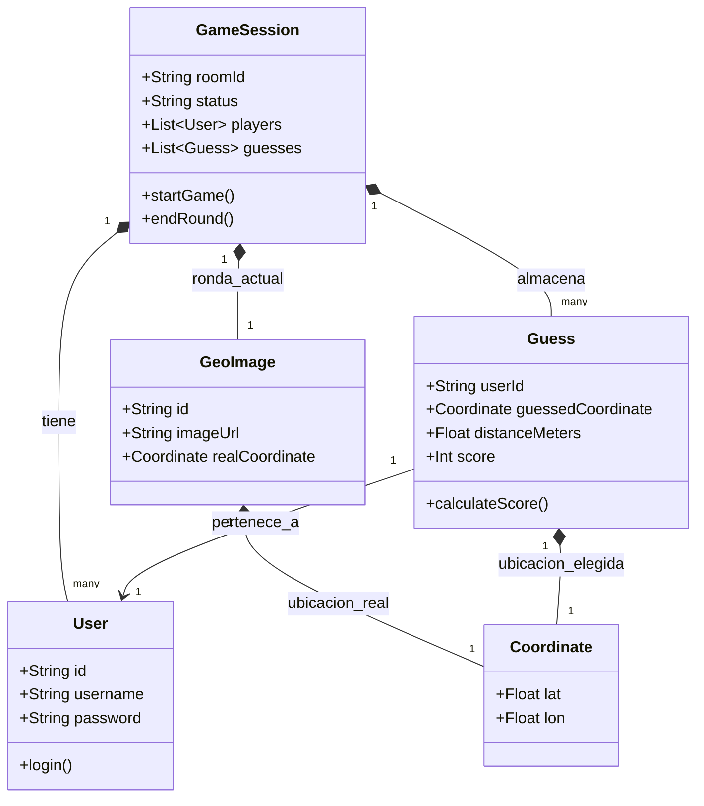

# Geo ezer

geoNode:{
  lat
  lon
}

user: {
  username
  password
}

geoImage:{
  imageUrl
  geoNode
}

userNode:{
  username
  geoNode
}

```mermaid
classDiagram
    class GameSession {
        +String roomId
        +String status
        +List~User~ players
        +List~Guess~ guesses
        +startGame()
        +endRound()
    }

    class User {
        +String id
        +String username
        +String password
        +login()
    }

    class GeoImage {
        +String id
        +String imageUrl
        +Coordinate realCoordinate
    }

    class Guess {
        +String userId
        +Coordinate guessedCoordinate
        +Float distanceMeters
        +Int score
        +calculateScore()
    }

    class Coordinate {
        +Float lat
        +Float lon
    }

    %% Relaciones
    GameSession "1" *-- "many" User : tiene
    GameSession "1" *-- "1" GeoImage : ronda_actual
    GameSession "1" *-- "many" Guess : almacena
    GeoImage "1" *-- "1" Coordinate : ubicacion_real
    Guess "1" *-- "1" Coordinate : ubicacion_elegida
    Guess "1" --> "1" User : pertenece_a
```
